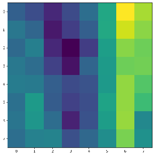
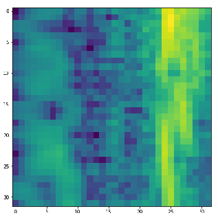
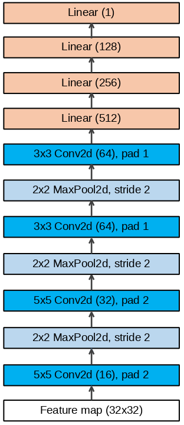
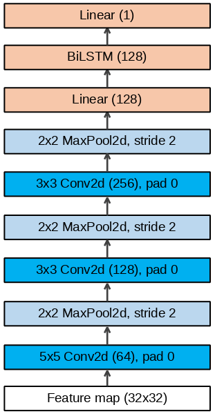
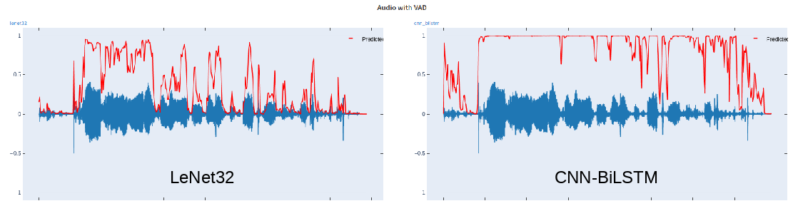
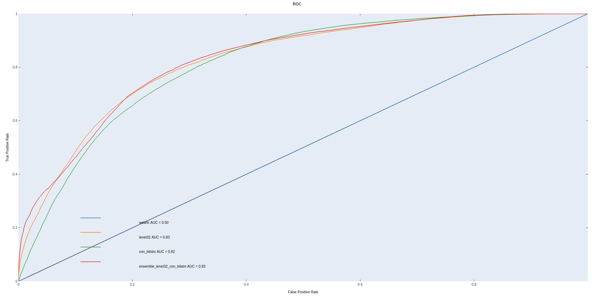
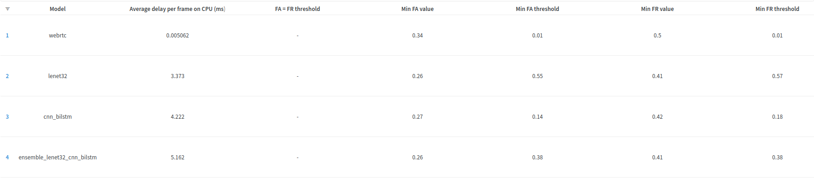

# Voice Activity Detection Test Assignment

## Abstract
In this work I try to make a Voice Activity Detection model
which should classify each 10ms frame of extremely noise audio
as speech or non-speech.

## Table of contents

1. [ Related work ](#related-work) 
2. [ Dataset ](#dataset)  
3. [ Dataflow ](#dataflow)
4. [ Models ](#models)

    4.1 [ Features ](#features)  
    4.2 [ Metrics ](#metrics)
    4.3 [ LeNet-32 ](#lenet-32) 
    4.4 [ CNN-BiLSTM ](#cnn-bilstm)  
    4.5 [ Ensembles ](#ensembles)

5. [ Results ](#results)  
6. [ How to improve? ](#how-to-improve)
7. [ Installation ](#installation)
8. [ Training ](#training)
9. [ Testing ](#testing)
10. [ Inference ](#inference)
11. [ Making submissions ](#making-submissions)
12. [ Conclusion ](#conclusion)
13. [ Reference ](#reference)

## Related work

| Model                                                                                                                                               |  Architecture   |                               Pros | Cons                                                                             |
|-----------------------------------------------------------------------------------------------------------------------------------------------------|:---------------:|-----------------------------------:|----------------------------------------------------------------------------------|
| [Google Webrtc-VAD](https://github.com/wiseman/py-webrtcvad)                                                                                        |       GMM       |                  Fast, lightweight | Performs well only on clean speach without noises, does not return probabilities |
| [Picovoice Cobra](https://github.com/Picovoice/cobra/)                                                                                              |     Closed      |                  Fast, lightweight | Minimum frame size is 30ms                                                       |
| [Silero VAD](https://github.com/snakers4/silero-vad/)                                                                                               |     Closed      |  Pretrained, good quality declared | Minimum frame size is 30ms                                                       |
| [Recurrent neural networks for voice activity detection](https://static.googleusercontent.com/media/research.google.com/en//pubs/archive/41186.pdf) |       RNN       |       Outperforms GMM based models | Classifies frame using next frames                                               |
| [A Hybrid CNN-BiLSTM Voice Activity Detector](https://arxiv.org/abs/2103.03529)                                                                     |     CNN-RNN     |              Good quality declared | Minimum frame size is 320ms                                                      |
| [Voice Activity Detection in Noisy Environments](https://github.com/nicklashansen/voice-activity-detection)                                         | RNN/CNN/CNN-RNN |              Good quality declared | Does not operate on 10ms frame size                                              |
| [Personal VAD: Speaker-Conditioned Voice Activity Detection](https://arxiv.org/pdf/1908.04284.pdf)                                                  |       RNN       |              Good quality declared | Different task, larger frame size                                                |


## Dataset
An ideal audio dataset for this task should:
1) have each 10ms frame annotated as speech/non-speech
2) consist of speech in different noisy environments 
3) be balanced

However, it is extremely difficult to obtain such a dataset.
Hence, in this work [LibriSpeech](https://www.openslr.org/12/) dataset (```clean``` subset) is used with different augmentations techniques
and online labeling by external voice activity detector.

[UrbanSound8k](https://www.kaggle.com/datasets/chrisfilo/urbansound8k) and [ESC-50](https://github.com/karolpiczak/ESC-50) noise datasets are used to mix with clean speech from LibriSpeech dataset.

## Dataflow
1) Load a speech audio-file and a random noise audio-file
2) Randomly apply augmentations to each (reverberation, clicks, etc.)
3) Mix them
4) Consider desired 10ms fragment
5) Apply external VAD to this fragment on clean speech audio to get true labels
6) In half of the cases return noisy or almost silenced fragment with label=non-speech.
   Otherwise, return fragment from mixed audio
7) Apply feature extraction (e.g. log mel-filterbank energy features)

## Models

### Features

[A little bit on feature selection, (see chap 4)](https://tspace.library.utoronto.ca/bitstream/1807/44123/1/Mohamed_Abdel-rahman_201406_PhD_thesis.pdf)

| Feature                           |                 Visual                  |                                                Description |
|-----------------------------------|:---------------------------------------:|-----------------------------------------------------------:|
| No features                       |              Raw waveform               |       Useful for external VAD classifiers, like Webrtc-VAD |
| Log Mel-Filterbank Energies 8x8   |     | winlen 3ms, winstep 1 ms, nfilt 8 <br/> VERY UNINFORMATIVE |
| Log Mel-Filterbank Energies 32x32 |  |                    winlen 2.3ms, winstep 0.25 ms, nfilt 32 |


### Metrics
The task is considered as a binary classification problem.
Hence, standard metrics and loss function are used: F1 score, Precision, Recall, Binary Cross Entropy Loss

### LeNet-32
Inspired by [Original LeNet architecture](http://vision.stanford.edu/cs598_spring07/papers/Lecun98.pdf)



### CNN-BiLSTM
Inspired by [A Hybrid CNN-BiLSTM Voice Activity Detector](https://arxiv.org/abs/2103.03529)



### Ensembles



CNN-BiLSTM turned out to be aggressive and quite sensitive to noise.
In contrast, LeNet32 give conservative predictions and is very cautious.

Can quality be improved by ensemble this two models? [At least it doesn't get worse](#results)

```ensemble_lenet32_cnn_bilstm``` - An ensemble with averaged predictions of LeNet32 and CNN-BiLSTM

In fact, the code allows to ensemble as many models as you want. Just specify all the checkpoints
and make sure all models use the same features.


## Results
### [More logs in WandB](https://wandb.ai/alidar40/vad_test/)

### ROC Curve


### Speed & thresholds statistics



## How to improve?

1) Consider different dataset labeling technique (e.g. [forced alignment](https://arxiv.org/abs/1908.04284))
2) Consider different features (e.g. 64x64 log mel-filterbank energies)
3) Try deeper neural network architectures and ensembles of them
4) Try different augmentations techniques

## Installation
1) ```python 3.8.10``` was used in this work
2) Check PyTorch version in ```requirements.txt``` according to your CUDA version
3) ```pip3 install -r requirements.txt``` (if you have problems with versioning then exact versions are specified in ```requirements_freezed.txt```)
4) Download datasets:
   1) [LibriSpeech](https://www.openslr.org/12/)
   2) [UrbanSound8k](https://www.kaggle.com/datasets/chrisfilo/urbansound8k)
   3) [ESC-50](https://github.com/karolpiczak/ESC-50)
5) Review ```config.yaml``` and make changes to suit your needs
6) ```mv .env.template .env```


## Training
1) Make sure ```config.yaml``` is configured
2) ```python train.py```

All training logs are available in [WandB project](https://wandb.ai/alidar40/vad_test/).


## Testing
Running ```test.py``` script will perform benchmarking with parameters specified in ```config.yaml```
1) Make sure ```config.yaml``` is configured (specify models, checkpoints, etc.)
2) ```python test.py```

Results will be logged to [WandB project](https://wandb.ai/alidar40/vad_test/) as a ```Benchmark``` run.
There will be a table with ```statistics``` for each model and a ```ROC-curve```


## Inference
[Demo colab notebook](https://colab.research.google.com/drive/1ItCHjUgdHBjf9IbjtNpm9S7Hrqw8uYZv?usp=sharing)

## Making submissions
1) [Run tests](#testing) to get threshold values (from ```Statistics``` table)
2) In ```config.yaml``` specify desired model, checkpoint, path to test data, thresholds
3) ```python submission.py``` will create ```submissions/``` directory with predictions

#### Submission was made with the ensemble model with threshold = 38% and is stored as ```submission.csv```

## Conclusion
This work was an attempt to solve the problem of voice activity detection in noisy environment.
Audio data processing pipeline was built with extensive augmentation techniques.
Two deep neural net architectures based on CNN and CNN-RNN were considered.

The results are not outstanding, but considering frame size limitations and contamination of speech audio they beat baseline of Google's WebRTC VAD

The codebase was written to continue research: new models (as well as dataprocessing pipelines) can be easily added, swapped, combined.

## Reference

[LibriSpeech](https://www.openslr.org/12/)
|
[UrbanSound8k](https://www.kaggle.com/datasets/chrisfilo/urbansound8k)
|
[ESC-50](https://github.com/karolpiczak/ESC-50)

[WebRTC VAD](https://github.com/wiseman/py-webrtcvad)

[Modern Portable Voice Activity Detector Released](https://habr.com/ru/post/537276/)

[Recurrent neural networks for voice activity detection](https://static.googleusercontent.com/media/research.google.com/en//pubs/archive/41186.pdf)

A Hybrid CNN-BiLSTM Voice Activity Detector:
[Paper](https://arxiv.org/abs/2103.03529)
| 
[Code](https://github.com/NickWilkinson37/voxseg/)

LeNet:
[Paper](http://vision.stanford.edu/cs598_spring07/papers/Lecun98.pdf)
|
[Code](https://d2l.ai/chapter_convolutional-neural-networks/lenet.html)

[Voice Activity Detection in Noisy Environments (Some code fragments/ideas/visualization taken)](https://github.com/nicklashansen/voice-activity-detection)

[Personal VAD: Speaker-Conditioned Voice Activity Detection](https://arxiv.org/abs/1908.04284)

[Deep Neural Network acoustic models for ASR](https://tspace.library.utoronto.ca/bitstream/1807/44123/1/Mohamed_Abdel-rahman_201406_PhD_thesis.pdf)
